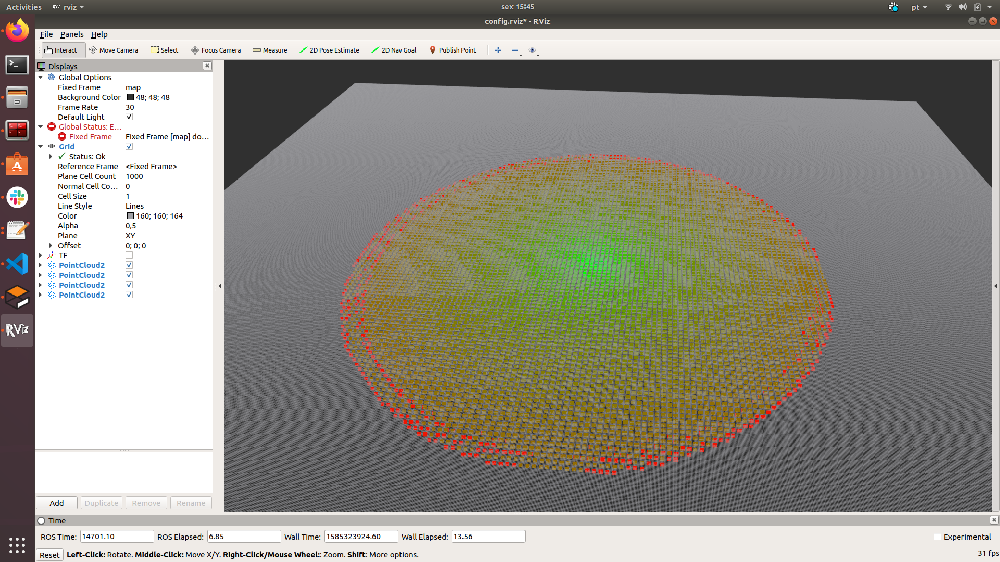

# wifi_comm_emulation: Wifi emulation for aquatic_simulator

> Developed for usage with [`aquatic_simulator`](https://github.com/ingeniarius-ltd/aquatic_simulator#readme)


This package aims to emulate the wifi behavior by republishing the defined topic between group of robots. 

### Setup

Define the topics namespaces and other values by modifying the parameters in _wireless_communication.launch_ file, the main ones are:

robot_prefix (string, default: wamv)  
&nbsp;&nbsp;&nbsp;&nbsp;robots namespace
    
gt_subs_namespace (Odometry, default: wamv)  
&nbsp;&nbsp;&nbsp;&nbsp;namespace of the ground truth topics
    
pose_subs_namespace (Odometry, default: wamv)  
&nbsp;&nbsp;&nbsp;&nbsp;namespace of the estimated position topics
    
wifi_sensitivity (float, default: -99)  
&nbsp;&nbsp;&nbsp;&nbsp;wifi sensitivity in Db
     
transmission_power (float, default: 20)  
&nbsp;&nbsp;&nbsp;&nbsp;wifi transmission power in Db
    
heatmap (bool, default: true)  
&nbsp;&nbsp;&nbsp;&nbsp;vizualization of the wifi heatmap


### Test

Launch _usv_uuv_simulator_:
    
```
$ roslaunch aquatic_simulator wamvs_rexrov2_oceanworld.launch 
```
And the _wireless_communication node_:
    
```
$ roslaunch wifi_comm_emulation wireless_communication.launch
```
The distribution of the wifi signal can be seen in the rviz:



## Purpose of the project

This software is a research prototype, originally developed for the Ingeniarius Lda.


